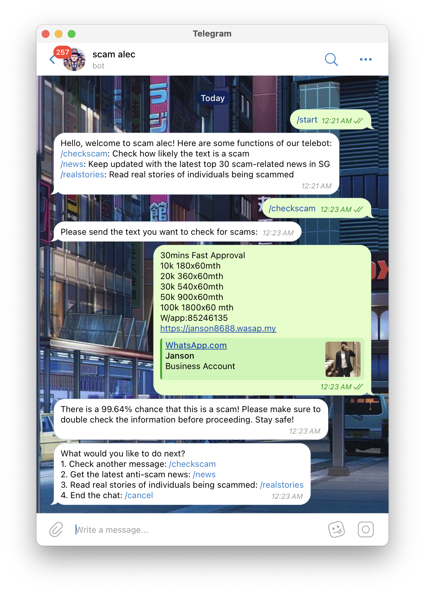
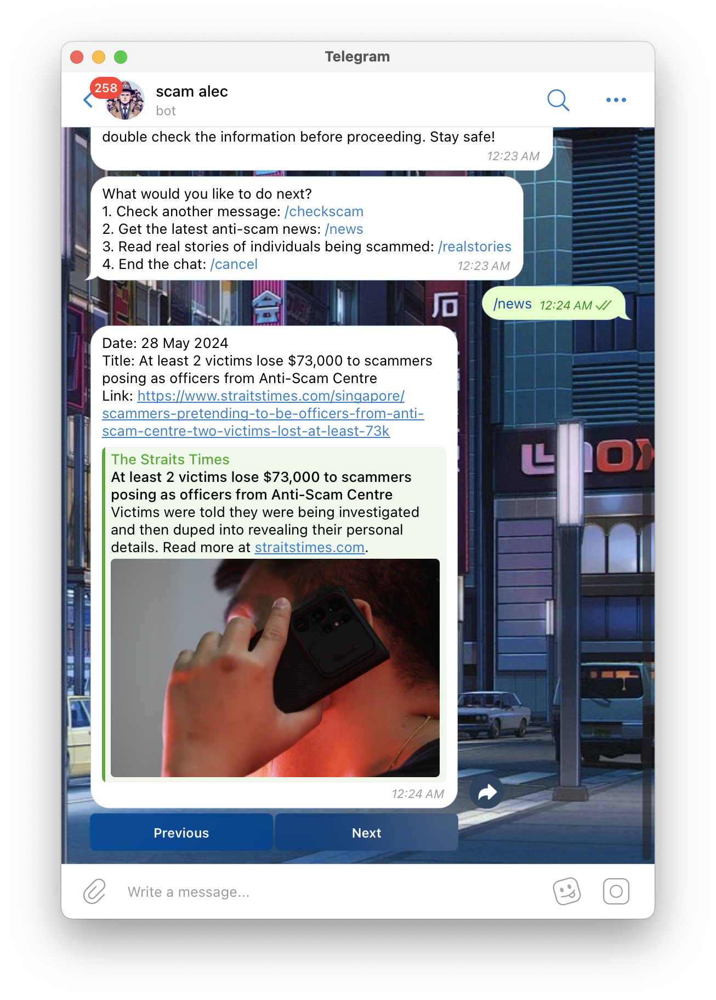

# scamalec

Welcome to Scam Alec!
Scam Alec, here to accompany you in this big bad world filled with scams from conmen.

## Features

### Start Command

Start the bot and see the available commands.


### Check Scam

Send a piece of text to the bot to check how likely it is to be a scam. Our trained bot will tell you the probability of that message being a scam!



### News

Get the latest anti-scam news Click on next or previous to toggle between news.



### Real Stories

Read real stories of individuals who have been scammed. Being scammed is more real that you think.


### Cancel

End the chat with the bot.


## Getting Started

Follow these instructions to get a copy of the project up and running on your local machine.

### Prerequisites

Make sure you have the following installed:

- Python 3.9 or later
- Git
- Pip (comes with Python)

### Installation

1. **Clone the repository**:

   ```bash
   git clone https://github.com/your-repo/scam-alec-bot.git
   cd scam-alec-bot
   ```

2. **Install the necessary packages**:

   ```bash
   pip3 install python-telegram-bot==13.14
   pip3 install git+https://github.com/eternnoir/pyTelegramBotAPI.git
   pip3 install transformers
   pip3 install tensorflow
   pip3 install tf-keras
   ```

   If you are using Windows, you may need to use `pip` instead of `pip3`:

   ```bash
   pip install python-telegram-bot==13.14
   pip install git+https://github.com/eternnoir/pyTelegramBotAPI.git
   pip install transformers
   pip install tensorflow
   pip install tf-keras
   ```

### Running the Bot Locally

1. **Set up environment variables**:

   ```bash
   source .env
   ```

2. **Run the bot**:
   ```bash
   python bot.py
   ```

### Usage

- Open Telegram and search for `@scamalec_bot`.
- Use the following commands to interact with the bot:
  - `/start`: Start the bot and see the available commands.
  - `/checkscam`: Check how likely a piece of text is to be a scam.
  - `/news`: Get the latest anti-scam news.
  - `/realstories`: Read real stories of individuals who have been scammed.
  - `/cancel`: End the chat.

### Additional Information

- **Privacy and Security**: Scam Alec respects your privacy and ensures that any data shared with the bot is not stored or used for any other purposes. Our goal is to educate and protect our users without compromising their security.
- **Support and Feedback**: If you have any questions, need support, or want to provide feedback, please reach out to our support team via the Telegram channel.
